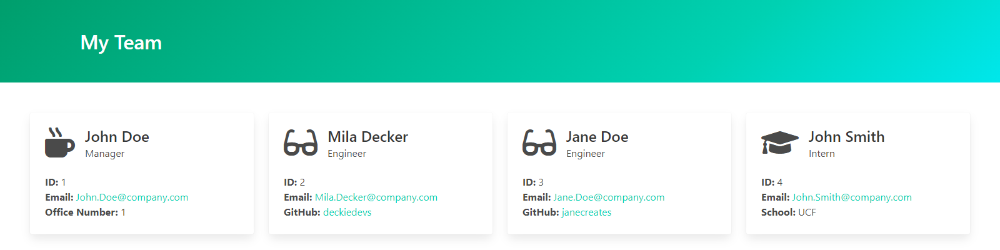

# Team Profile Generator

## Description
A Node.js application to create a simple webpage featuring your development team's roster.

## Contents
* [Installation](#Installation)
* [Usage](#Usage)
  
   * [Screenshots](#Screenshots)
* [Tests](#Tests)
* [Questions](#Questions)
* [Credits](#Credits)


## Installation
To use this application, please install: 
```
npm install inquirer
```
    
## Usage
After cloning the repo and installing the required npm packages, use the command line to navigate to the root of the application and run `app index`.  Follow prompts to add team members to your roster.  Only one manager can be added per team.  Your generated team roster page will be created in the `./dist` folder. 
    

### Screenshots

The application runs from the command line as seen above.
<br/><br/>

An example of the generated team roster page.


## Tests
To run tests on the application, install
```
npm install jest
```

and run `npm run test` from the command line.
    
## Questions
If you have any questions about the repo, please [open an issue](https://github.com/javiddelossantos5) or contact me via email at javiddelossantos5@gmail.com. You can find more of my work on my GitHub, [javiddelossantos5](https://github.com/javiddelossantos5/).

## Demo
since this application is run through the terminal, there is no website to view. To see how this application works, please follow the link below to view a walkthrough video.

<a href="https://drive.google.com/file/d/1ioYNdYE-hckdsu_jZ71g-0X3K1inCW6I/view?usp=sharing" target="_blank">Click here to watch the video!</a>
    
## Credits
* Styles for the generated page powered by [Bulma](https://bulma.io/).
* Employee icons furnished by [Font Awesome](https://fontawesome.com/).
* Encouragement and solidarity provided by Curtis Lane, TA extrordinaire. 